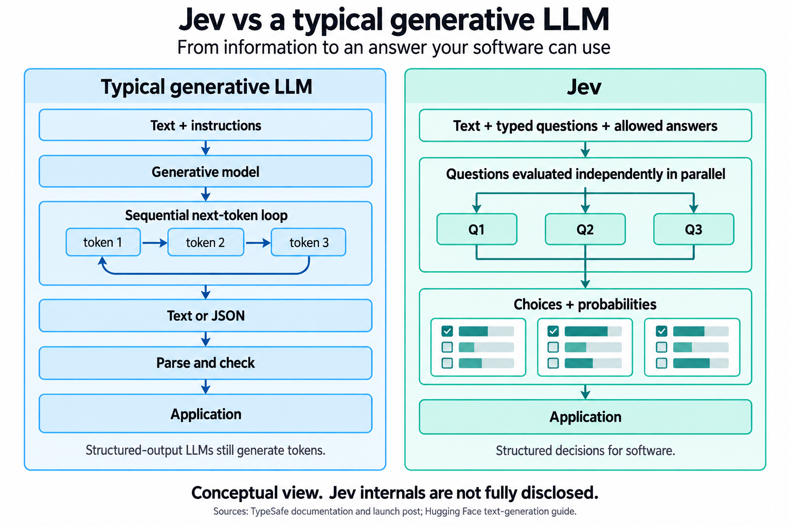

# What a small classification experiment tells us about Jev

Prepared on 18 September 2026 as background material for a blog post. Results come from the saved runs in this repository; the explanation of Jev draws on TypeSafe's public documentation.

Jev performed better than GPT-4o mini on three text-classification tasks in this experiment. Giving each task equal weight, Jev answered **91.7% correctly**, compared with **81.3% for GPT-4o mini**. Jev also had shorter response times and lower estimated API costs. That is a promising result for software that needs to put text into predefined categories.

The main qualification is that the test required both models to return a valid set of probabilities as well as identify the right category. GPT sometimes returned numbers that did not add up to one. Those answers counted as failures. On the user-intent task, this explains much of Jev's lead. The experiment therefore measures the complete job of returning a usable classification, including the probability output.

The comparison used `jev-1.13.0` and `gpt-4o-mini-2024-07-18`. It tells us about these two versions under this setup. It does not establish how Jev compares with every LLM, newer models, or other ways of prompting GPT.

Both models received the same text, task instructions, category names, and category descriptions. Neither received worked examples or task-specific training from this project. GPT used temperature zero and strict structured output. The final benchmark covered 1,250 texts, with one completed response from each model per text: 2,500 API calls in total.

| Task | What the model had to decide | Texts |
|---|---|---:|
| AG News | Which of four news topics fits an article? | 400 |
| TREC | What kind of answer does a question ask for, such as a person, place, or number? | 500 |
| SNIPS | What does a user want to do, such as play music or book a restaurant? | 350 |

AG News and SNIPS had equal numbers of examples per category. TREC used its full test set, where some answer types are much rarer than others. The prompts and samples were fixed before the final run. An earlier incomplete attempt led to a change in failure handling: invalid completed answers would count as incorrect and the run would continue. All three tasks were then run afresh. The earlier responses were excluded from the final scores. The [benchmark protocol](BENCHMARK_PROTOCOL.md) records this change.

The main results were:

| Task | Jev correct | GPT-4o mini correct | Jev's lead |
|---|---:|---:|---:|
| News topics | 347/400 — **86.8%** | 308/400 — **77.0%** | **9.8 percentage points** |
| Question answer types | 458/500 — **91.6%** | 385/500 — **77.0%** | **14.6 percentage points** |
| User intents | 339/350 — **96.9%** | 315/350 — **90.0%** | **6.9 percentage points** |

The average lead was **10.4 percentage points**, with each task counting equally. A percentage-point difference describes the gap between two percentages: roughly ten additional correct answers per hundred here, averaged across the tasks. It is not the same as saying “10.4% better.” The separate measure called macro-F1, which balances missed cases and wrong assignments within each category, also favored Jev on all three tasks. Its equal-task average was 0.915 for Jev and 0.823 for GPT.

The uncertainty estimates also favored Jev within these samples. The 95% bootstrap ranges for its accuracy lead were 6.5–13.0 percentage points on news, 11.0–18.2 on question types, and 4.6–9.1 on user intents. These ranges were calculated by repeatedly drawing from the saved examples, keeping the two models paired on each example. They describe uncertainty from the sampled texts under that method. They do not account for choosing different tasks, training-data overlap, or repeating the model calls. The exact scores and methods are in the [saved comparison](results-benchmarks/comparison.md).

The probability failures deserve a closer look. GPT had 24 invalid responses: two on news and 22 on user intents. Jev had one, on user intents. All 25 failed the check that probabilities must add up to one, within the allowed rounding tolerance. This was a numerical validity problem, not evidence of broken JSON syntax. The configured JSON schema required the right fields and numeric values; the application separately checked their range and total. The [provider code](providers.py) contains these checks.

To understand the effect, a follow-up analysis looked only at texts where **both** models returned valid responses:

| Task | Texts retained | Jev accuracy | GPT accuracy |
|---|---:|---:|---:|
| News topics | 398/400 | 86.9% | 77.4% |
| Question answer types | 500/500 | 91.6% | 77.0% |
| User intents | 327/350 | 97.2% | 96.3% |

On user intents, the gap shrank to about **0.9 percentage points**. Jev's news and question-type advantages remained much larger. This narrower analysis helps explain the results, but it selects examples based on the responses and cannot tell us what either model would have predicted on its failed outputs. It does not replace the main scores. A separate test that asks GPT for only a category would help distinguish classification ability from the difficulty of generating probabilities.

Individual mistakes make the numbers easier to understand. TREC includes “How far is it from Denver to Aspen ?” The expected answer type is a number: a distance. Jev chose the numeric category; GPT chose location. That illustrates the difference between recognizing the places mentioned and recognizing what the question asks for. Jev also made mistakes: for “What does cc in engines mean ?”, the dataset expects a description. GPT chose that category, while Jev chose abbreviation. These are illustrative examples, not a complete account of why either model performed as it did. The [TREC snapshot](data-benchmarks/trec/issues.json) and [predictions](results-benchmarks/trec/predictions.json) preserve the cases.

Jev's typical response took about six-tenths of a second. GPT's took roughly nine-tenths to one second. “Typical” here means the median: half of requests were faster and half slower.

| Task | Jev median time | GPT median time | Jev estimated cost | GPT estimated cost |
|---|---:|---:|---:|---:|
| News topics | 0.600 s | 0.984 s | $0.007501 | $0.019205 |
| Question answer types | 0.604 s | 0.941 s | $0.010803 | $0.031430 |
| User intents | 0.605 s | 1.042 s | $0.007493 | $0.023624 |
| **Cost across all three tasks** | — | — | **$0.025797** | **$0.074259** |

Jev's median request time was about **36–42% lower**, depending on the task. Its total estimated token cost was about **65% lower**; GPT cost about 2.9 times as much. Both totals were under ten US cents. These are estimates using saved token usage and the configured rates: Jev at $0.042 per million input tokens with free output, and GPT at $0.15 per million input tokens and $0.60 per million output tokens. They are not billing statements or promises about future prices.

The timing includes the network and local response processing. Up to three datasets ran concurrently, and provider order alternated. These measurements describe this environment and request format. They do not isolate the model's computation time or prove that architecture alone caused the difference. This study also asked one classification question per call, so it did not test Jev's advertised benefit from answering many independent questions together.

An earlier exploratory test used **200 Flutter GitHub issues** and asked which of four teams owned each issue. Jev scored **76.0%**, compared with **65.5%** for GPT. These results are kept separate because they helped shape the later study. They also show why a favorable average is not enough: Jev correctly identified only **18 of 50 iOS issues**, and assigned 31 of them to the tooling team. GPT identified 21 of the 50 iOS issues. Team ownership can be ambiguous, and GitHub labels are imperfect reference answers. The [Flutter report](results/report.json) contains the breakdown.

To understand the image, start with how a typical generative LLM produces an answer. It predicts a token, a small piece of text, then continues using what it has already produced. Repeating this process builds prose, code, or a structured response such as JSON. Structured output can constrain the format, while the answer is still generated as tokens. This is a simplified description of the usual autoregressive generation process. [Hugging Face text-generation documentation](https://huggingface.co/docs/transformers/llm_tutorial).

Jev's documented interface asks developers to supply the content, specific questions, and permitted answer choices or scales. It returns typed values and probabilities. TypeSafe says independent questions are evaluated in parallel against the same content. For example, software could ask which team should handle a message and separately whether it requests a refund. The application then combines the answers using its own rules. [TypeSafe introduction](https://docs.typesafe.ai/introduction), [System One documentation](https://docs.typesafe.ai/concepts/system-one).

TypeSafe describes a parallel sampler and a training method called **reinforcement learning for calibrated decisions**, or RLCD. In plain language, the stated goal is to train useful decisions with probabilities that match observed outcomes. Those are the company's descriptions of its design. This experiment did not inspect the model's internals or independently establish that its probabilities are calibrated. The cited public sources do not provide enough detail to draw its internal neural layers. [TypeSafe launch article](https://typesafe.ai/blog/introducing-system-one-models-and-jev), [AI primer](https://docs.typesafe.ai/introduction/machine-learning-primer).

*Image caption: A conceptual comparison of the documented output processes. A typical generative LLM builds text or JSON as a sequence of tokens. Jev returns decisions over predefined answer spaces and, according to TypeSafe, evaluates independent questions in parallel. This is not a diagram of Jev's undisclosed neural layers. A valid output can still contain a wrong decision.*

Confidence needs similar care. A probability of 90% is a number to test against outcomes, not a guarantee that a particular answer is correct. GPT's probabilities here were numbers it was asked to write. Jev supplied probabilities through its decision interface, plus a separate confidence statistic derived from the distribution. The experiment's confidence filtering used the chosen category's probability, not that separate Jev statistic. Equal thresholds do not necessarily mean equal reliability. The saved analysis does not establish calibration for either model. [TypeSafe confidence documentation](https://docs.typesafe.ai/confidence), [experiment protocol](BENCHMARK_PROTOCOL.md).

For a blog post, the strongest supported claim is: **In this small comparison with GPT-4o mini, Jev returned more correct, usable classifications at lower measured latency and estimated token cost. The size of its lead and the role of invalid probability outputs varied by task.**

The evidence leaves several questions open. Public datasets may have appeared in either model's training data. Balanced test samples differ from real traffic. Only one completed response was collected per model per text, so this does not measure consistency across repeated calls. The study covered narrow English classification tasks, not writing, coding, or extended reasoning. It also compared one LLM version and one fixed prompt setup.

A useful next experiment would add a category-only GPT baseline, another current LLM, and fresh examples from the intended application. A separate set of examples could test confidence thresholds before they are used for automation. That would help answer the practical question raised by these findings: where does Jev's decision interface improve a real workflow, and where does the choice of model, prompt, or category definition matter more?

All numerical claims above are grounded in the [final machine-readable comparison](results-benchmarks/comparison.json), [final benchmark predictions](results-benchmarks/), [frozen input snapshots](data-benchmarks/), and [separate Flutter results](results/report.json). The image's generation prompt, sources, and alt text are in [image notes](report-assets/image-notes.md).
